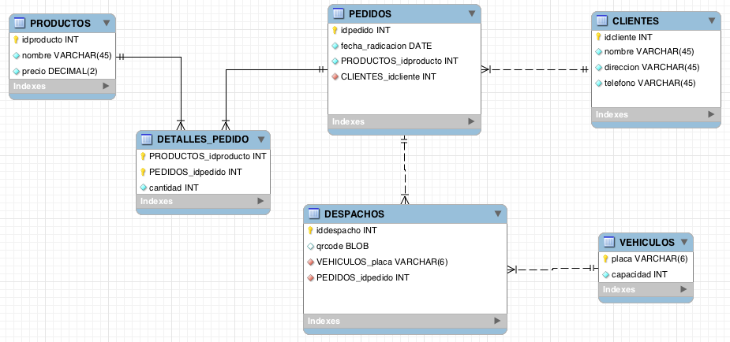
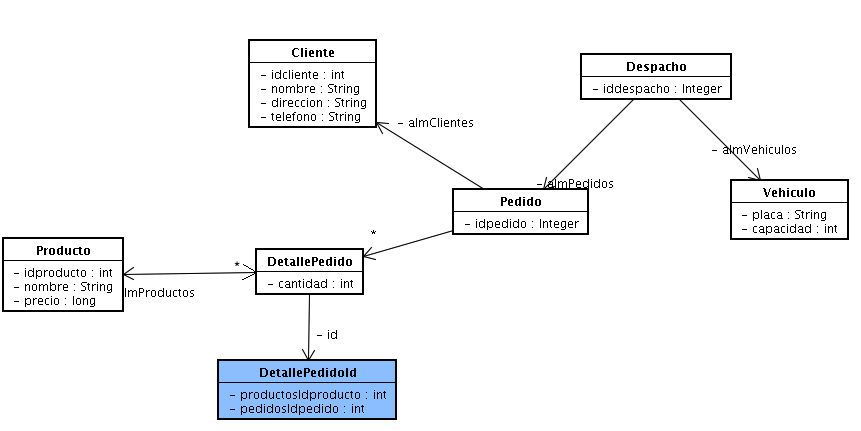
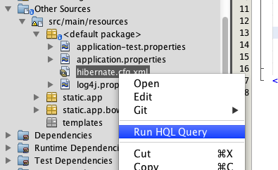

**Escuela Colombiana de Ingeniería**

**Construcción de Software – COSW**

**Frameworks de persistencia ORM**


El diagrama de la figura 1 corresponde a un modelo ER para un sistema de
envío de pedidos, para el cual ya se generó (mediante ingeniería inversa
y algunos ajustes) un modelo de clases mapeado para hacerlo persistente
(figura 2). Adicionalmente, se tiene una primera versión de un API REST que permite hacer consultas de productos, pedidos y despachos.



Figura 1 Modelo ER



Figura 2 - Modelo de clases mapeado


##Parte I.##

1. Revise el controlador de productos, e identifique a través de qué URL se podrá consultar -mediante una petición GET- se puede consultar el listado completo de productos.
2. Inicie la aplicación y desde un navegador ingrese la URL correspondiente para consultar los productos. Qué particularidad encuentra en el resultado?. Observe que en este caso la relación entre Producto y DetallePedido es BIDIRECCIONAL, de manera que se está dando un 'loop' en la serialización de Objeto a JSON. Para resolver esto hay dos opciones
	* Dejar la relación unidireccional.
	* Agregar la anotación __@JsonIgnore__ en la propiedad que se quiera omitir en la serialización Objeto-JSON (es decir, en su método 'get' correspondiente). En este caso, lo deseable sería que al serializar el Producto, se ignore la colección de DetallePedido.

	Aplique la segunda solución y verifique los resultados.

3. Revise el controlador de pedidos e identifique con qué URL se pueden consultar las órdenes. De nuevo, pruebe la consulta a través de un navegador. Revise el error presentado, y busque en qué contexto se menciona la palabra 'Lazy'. Para resolver el problema, cambie la manera como JPA realiza las consultas que asocian los objetos relacionados directa e indirectamente con Pedido (DetallePedido, Cliente y Producto) cambiando el mecanismo de 'fetching' que por defecto se dan entre Pedido-Cliente, Pedido-DetallePedido y DetallePedido-Producto:

	```java
	 @Fetch(FetchMode.JOIN)
	```
4. Pruebe que el API retorne correctamente las ordenes a través de un navegador.
5. Revise el controlador de Despachos, e identifique la URL para la consultar un determinado despacho. Intente consultar el despacho #1 y analice el error obtenido.
6. Use la anotación @JsonIgnore para que en la serialización de Objeto a JSON no se intente serializar el propiedad de tipo BLOB del despacho.

7. En el mismo controlador, agregue una ruta que permita -exclusivamente- consultar la imagen del código QR asociado a un despacho (al igual se que había hecho en un ejercicio anterior):

	```java
    @RequestMapping(value = "/{id}/qrcode", method = RequestMethod.GET)
    @ResponseBody
    public ResponseEntity<InputStreamResource> getQRCode(@PathVariable Integer id) {
		try {            
            return ResponseEntity.ok()
                    .contentType(MediaType.parseMediaType("image/png"))
                    .body(new InputStreamResource(  INPUTSTREAM     ));
        } catch (ServicesException ex) {
            Logger.getLogger(DispatchController.class.getName()).log(Level.SEVERE, null, ex);
            return new ResponseEntity<>(HttpStatus.INTERNAL_SERVER_ERROR);
            
        } catch (SQLException ex) {
            Logger.getLogger(DispatchController.class.getName()).log(Level.SEVERE, null, ex);
            return new ResponseEntity<>(HttpStatus.INTERNAL_SERVER_ERROR);
        }
    
    }
	```

8. Modifique el código anterior para que en como INPUTSTREAM, se pase el InputStream de la propiedad de tipo Blob del Despacho. Es decir, debe usar los servicios inyectados para consultar el despacho respectivo, a y a éste consultar el InputStream de su propiedad 'qrcode'.

9. Rectifique que a través del navegador se pueda consultar la imagen del código QR asociado a un despacho.

## Parte II.

1. Abra el cliente HQL de NetBeans, haciendo clic derecho sobre el archivo 'hibernate.cfg.xml' (si no está en su proyecto, puede copiarlo de este repositorio de la ruta src/main/resources): 

2. Diseñe las siguientes consultas HQL, haciendo uso de las facilidades de [Joins explícitos](https://docs.jboss.org/hibernate/orm/3.3/reference/en/html/queryhql.html#queryhql-joins) de JPA:

	* Dado el identificador de un producto, determinar qué vehículos han transportado alguna vez dicho producto.
	* Dado un valor en pesos, determinar qué clientes han comprado alguna vez productos con un valor superior al indicado.


3. Cree (si no lo tiene aún) el repositorio de vehículos, y agregue en éste una consulta (@Query) que reciba como parámetro el identificador de un producto y que retorne un listado de vehículos. Asocie a ésta la primera consulta.

4. Cree el repositorio de Clientes, y agregue en éste una consulta (@Query) que reciba como parámetro un entero, y y que retorne una lista de Clientes. Asocie a ésta la segunda consulta.

3. Agregue a su API REST un par de recursos que permitan acceder a dichas consultas.


## Parte III.##

Ahora, va a crear en su API un servicio capaz de manejar peticiones de tipo 'multipart' (para enviar archivos binarios en lugar de documentos jSON). Esto se basa en una adaptación de dos blogs de [cantangoslutions.com](http://www.cantangosolutions.com/blog/Easy-File-Upload-Using-DropzoneJS-AngularJs-And-Spring) para el 'back-end' y 
[uncorkedstudios.com](http://uncorkedstudios.com/blog/multipartformdata-file-upload-with-angularjs) para el 'front-end':

1. Si los fuentes de su proyecto no incluyen aún el cliente Angular.js, actualícelo con los fuentes de este repositorio (el cliente está en /src/main/resources/static).
2. En sus servicios de aplicación, agregue una operación que permita registrar un nuevo despacho (la cual debe usar el Repositorio de despachos).
3. Agregue el siguiente recurso a su API REST, en el controlador de Despachos. 

	```java	
	@RequestMapping(
		value = "/upload",
		method = RequestMethod.POST
	)
	public ResponseEntity uploadFile(MultipartHttpServletRequest request,@RequestParam(name = "idpedido") int idpedido, 		@RequestParam(name = "idvehiculo") String idVehiculo) {

		try {
			Iterator<String> itr = request.getFileNames();

				while (itr.hasNext()) {
					String uploadedFile = itr.next();
					MultipartFile file = request.getFile(uploadedFile);

					Pedido p=orderrepo.findOne(idPedido);
					Vehiculo v=vehicrepo.findOne(idVehiculo);

					Despacho d=new Despacho(p, v);
					d.setQrcode(new SerialBlob(StreamUtils.copyToByteArray(file.getInputStream())));                                                

					//-->> GUARDAR EL DESPACHO A TRAVÉS DEL SERVICIO CREADO

			}
		}
		catch (Exception e) {
			return new ResponseEntity<>("{}", HttpStatus.INTERNAL_SERVER_ERROR);
		}

		return new ResponseEntity<>("{}", HttpStatus.OK);
	}
	```
4. Complete lo que falta del código anterior para insertar un nuevo despacho.
5. Rectifique que la URL a través de la cual se accedería al recurso antes creado, coincida con la utilizada por el cliente Angular.js (línea 50 del archivo 'modulo.js'). Pruebe la aplicación cargando una imagen pequeña en formato PNG, y luego consultándolo a través de la URI de códigos 'qr' realizada en el punto I.
